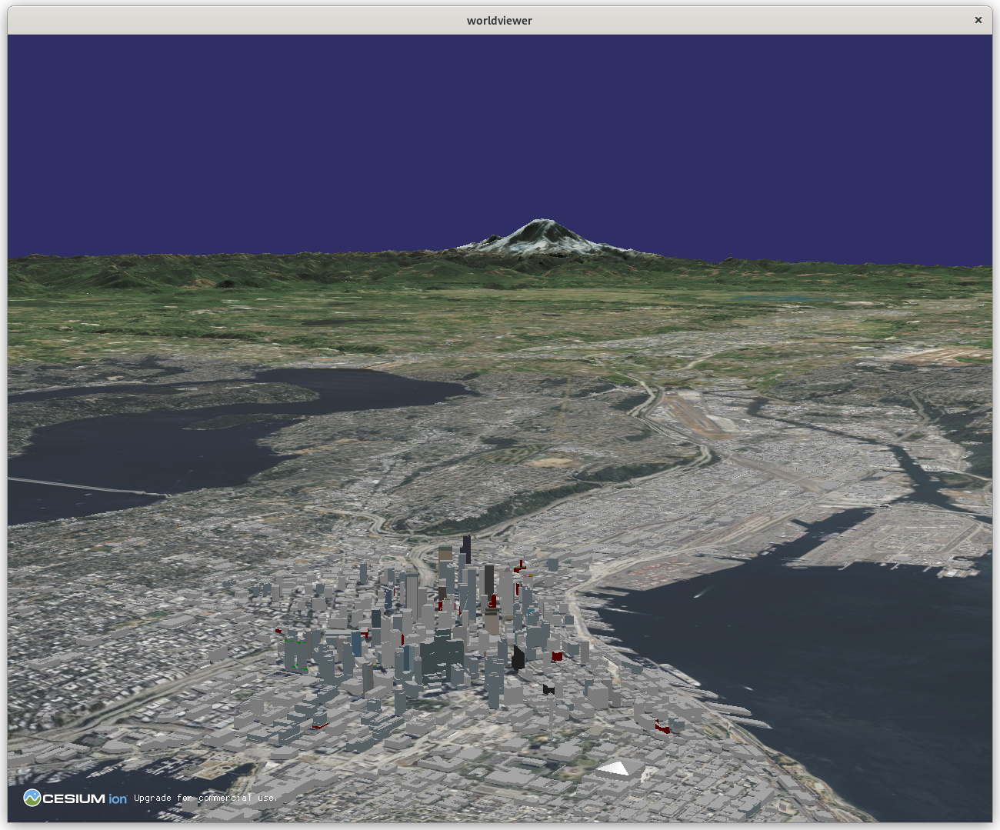
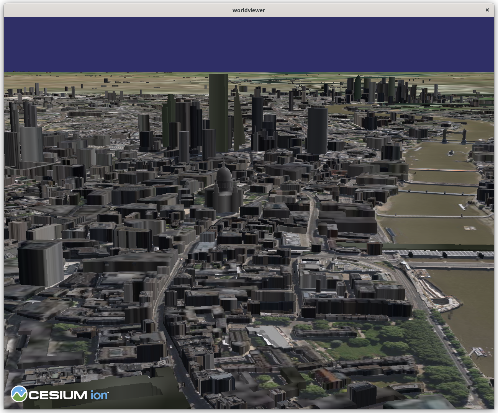

vsgCs  —  3D Tiles and Cesium ion for VSG
=====
vsgCs is a library for using [3D
Tiles](https://github.com/CesiumGS/3d-tiles) and other geospatial
    content within a [Vulkan Scene Graph](https://github.com/vsg-dev/VulkanSceneGraph) (VSG)
    application. In particular, it can download assets from a 
    [Cesium ion](https://cesium.com/platform/cesium-ion/) server.



For streaming and loading content, vsgCs uses the [Cesium Native](https://github.com/CesiumGS/cesium-native)
package, which also "powers Cesium's runtime integrations for
[Cesium for Unreal](https://github.com/CesiumGS/cesium-unreal),
[Cesium for Unity](https://github.com/CesiumGS/cesium-unity), and
[Cesium for O3DE](https://github.com/CesiumGS/cesium-o3de)."

---

## Features

- Streaming of geospatial assets into a VSG scene graph
  - 3D Tiles tilesets with [glTF](https://www.khronos.org/gltf/) models
  - Cesium ion assets
  
- Multiple tilesets in a scene
- Image overlays on tilesets
  - Multiple layered overlays with individual alpha values

- Whole-Earth terrain paging
- Example viewing application

---

## News
- June 12, 2023: Version 0.4 is released! This release is dedicated to the memory of Alicia Hills
  Moore (1930-2023). My mother was fascinated by computer graphics and interviewed many of its
  pioneers during a long career as a journalist.
  
  For version 0.4:
  - The build process is more self-contained and will now download Cesiuam native libraries and VSG.
  - vsgCs can stream Google Maps Photorealistic 3D Tiles.
  - Some support for tile styling has been added. If present, the `cesium#color` feature attribute is
    used to color tiles.
  - The management of web connections and data download has been greatly improved.
  - The mouse manipulator from the [rocky](https://github.com/pelicanmapping/rocky) project has been
    integrated. This provides better interactive control, especially close to the Earth, than the
    default VSG trackball manipulator.
  - Support for the [Tracy](https://github.com/wolfpld/tracy) profiling package has been added.
  - The credits display has been rewritten, using images and attribution from the data sources.
  - A "time of day" argument has been added to the `worldviewer` application, which is used in
    positioning the default light i.e., the Sun.
  - Point clouds in 3D tiles can be rendered.
---

## Installation - Quick Start

vsgCs will now download most of its dependencies as part of the configuration and build process. The
only dependencies that need to be explicitly installed are:
- `libcurl` This is best installed via a package manager.
- the [Vulkan SDK](https://vulkan.lunarg.com/sdk/home) from LunarG. Follow installation instructions
  for your operating system.
- The `git-lfs` component of git. This comes with Git for Windows but is not installed by default on Linux.

### Command line build instructions:

To build and install the static library (libvsgCs.a / libvsgCs.lib) and sample
application (worldviewer) on Linux:
```
    git clone https://github.com/timoore/vsgCs.git
    mkdir build # or wherever you like
    cd build
    cmake ../vsgCs.git -DCMAKE_BUILD_TYPE=Debug
    make -j 8
    sudo make install
```

The `cmake` part may take a long time to download the Cesium Native library and its dependencies. If
you encounter a git error, see [the install instructions](INSTALL.md) for possible workarounds.

## vcpkg

Install `xorg-macros`, `xproto`, xcb-proto`, `libXdmcp-devel`, `libXau-devel`
---


## Usage

See [usage instructions](USAGE.md).

---

## Status

vsgCs and `worldviewer` have been tested with the Cesium World Terrain
and other imagery and tilesets available in the Cesium ion Asset
Depot. The OSM Buildings tileset works. For future directions, check
out our [roadmap](doc/ROADMAP.md). Enjoy!


