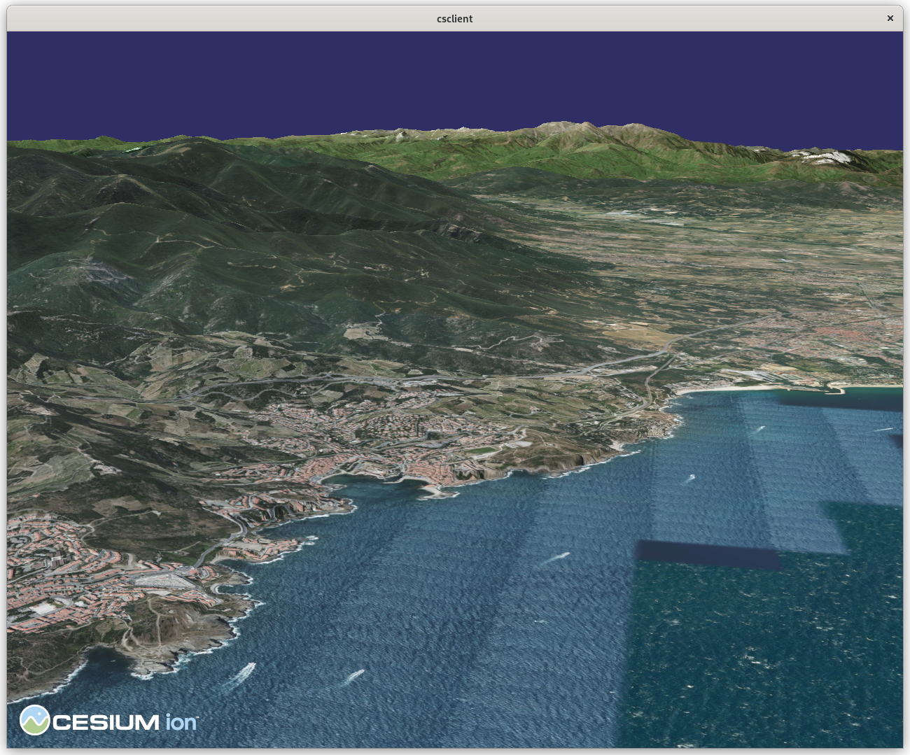
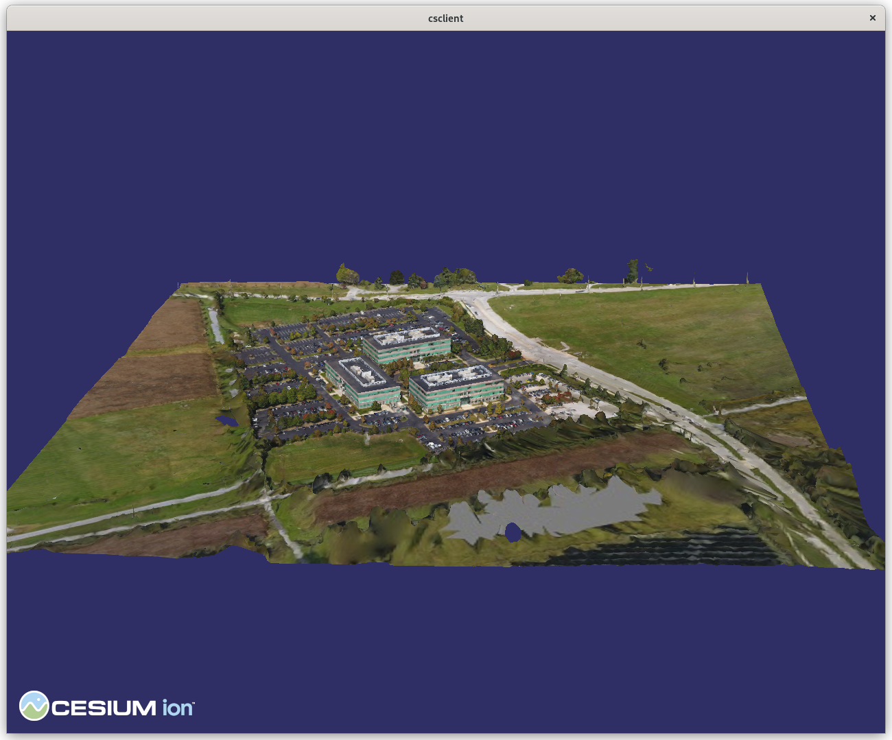

vsgCs  — Cesium ion and 3D Tiles for VSG
=====
vsgCs is a library for using [3D
Tiles](https://github.com/CesiumGS/3d-tiles) and other geospatial
    content within a [Vulkan Scene Graph](https://github.com/vsg-dev/VulkanSceneGraph) (VSG)
    application. In particular, it can download assets from a 
    [Cesium ion](https://cesium.com/platform/cesium-ion/) server.



For streaming and loading content, vsgCs uses the [Cesium Native](https://github.com/CesiumGS/cesium-native)
package, which also "powers Cesium's runtime integrations for
[Cesium for Unreal](https://github.com/CesiumGS/cesium-unreal),
[Cesium for Unity](https://github.com/CesiumGS/cesium-unity), and
[Cesium for O3DE](https://github.com/CesiumGS/cesium-o3de)."

---

## Features

- Streaming of geospatial assets into a VSG scene graph
  - 3D Tiles tilesets with [glTF](https://www.khronos.org/gltf/) models
  - Cesium ion assets
  - image overlays

- Whole-Earth terrain paging
- Example viewing application

---

## Installation

### Prerequisites:
#### Vulkan Scene Graph libraries
Follow the installation instructions for:
- [VulkanSceneGraph](https://github.com/vsg-dev/VulkanSceneGraph). In
  particular, you will need the [Vulkan SDK](https://vulkan.lunarg.com/sdk/home)
  from LunarG.
- [vsgImGui](https://github.com/vsg-dev/vsgImGui)

#### Cesium Native

Download  [Cesium Native](https://github.com/CesiumGS/cesium-native),
follow its compilation instructions, and install. 

Note: if you build a debug version of Cesium Native, you must remove
the NDEBUG flag from vsgCs compilation; see
CMakeModules/FindCesium.cmake.

### Command line build instractions:

To build and install the static library (libvsgCs.a / libvsgCs.lib) and sample
application (csclient):
```
    git clone https://github.com/timoore/vsgCs.git
    mkdir build # or wherever you like
    cd build
    cmake ../vsgCs.git
    make -j 8
    sudo make install
```
---


## Usage

### Cesium ion

Unless you have your own 3D Tiles tilesets, you will need to stream
content from Cesium ion, so [create and account there](https://ion.cesium.com/signup/)
if you need to. Do the tutorial for creating a 3D tile if you want. Your "My Assets" page will look
something like:


vsgCs uses the asset IDs in the left column to stream data from Cesium
ion. The assets with type "Imagery" can't be used on their own; they
must be draped over a tileset. Asset 1, "Cesium World Terrain", is
a tileset with only elevation data, so must be used with an overlay to
be useful.

### Access token

Any interaction with a Cesium ion server requires an access token. On
the "Access Tokens" page of Cesium ion, copy your token. while it can
be passed on the command line to csclient, it is more convenient to
store it in a file e.g., `.cesiumiontoken` in your home directory.

### `csclient`

The `csclient` program demonstrates the basic features of vsgCs. To
view the world:

```
csclient --ion-asset 1 --ion-overlay 2 --ion-token-file ~/.cesiumiontoken
```

which should produce:


`csclient` also displays discrete 3D Tiles tilesets. In my Cesium ion
account the AGI building has asset id 1418857, so:

```
csclient --ion-asset 1418857 --ion-token-file ~/.cesiumiontoken
```

produces



---

## Status

vsgCs is not yet a mature project. It has not been tested on Windows,
but patches (if needed) are welcome! `csclient` may crash, and take
your machine down with it. The `--debug` flag is recommended if you do
any development with vsgCs. There are many bugs to fix and features to
implement, so stay tuned!

