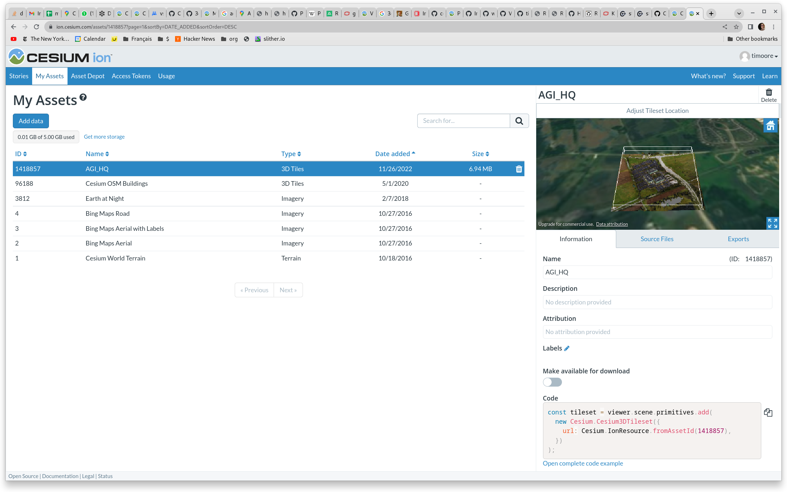
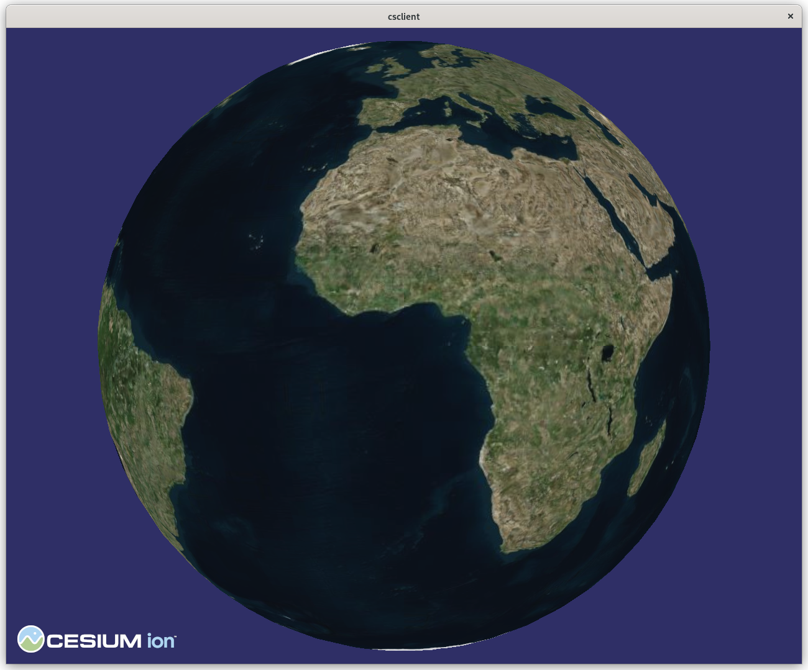
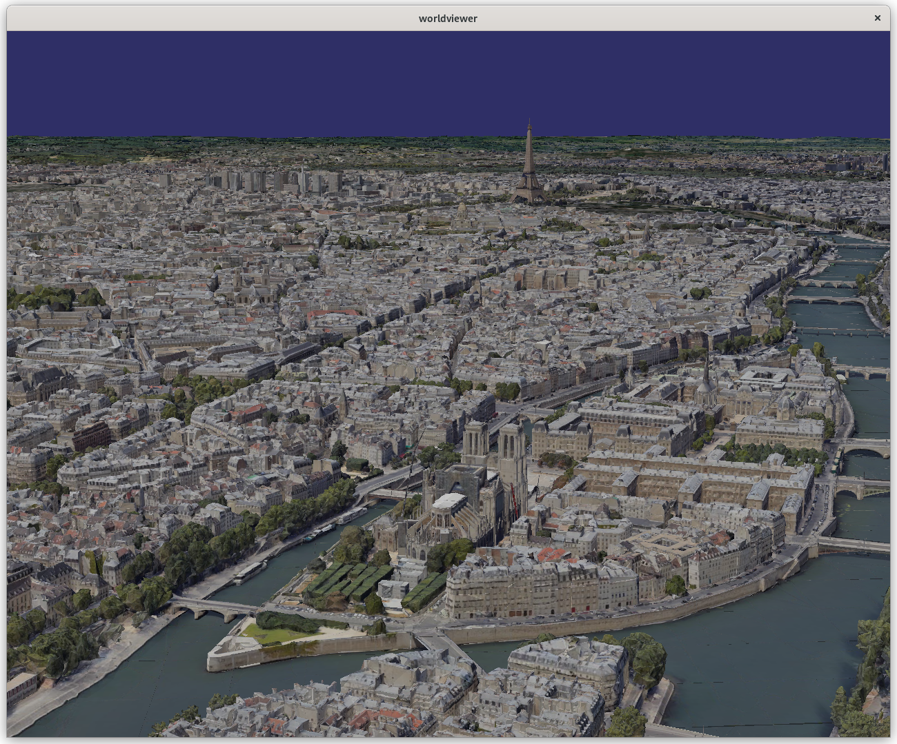

# vsgCs Usage

## JSON World files

vsgCs and the `worldviwer` program can read a simple JSON description
of the tilesets and overlays to include in a scene. The simplest example is [tests/csterrain.json](tests/csterrain.json):

```
{  "Type": "World",
   "tilesets": [
       {
       "Type": "Tileset",
       "ionAssetID":1,
       "overlays": [
           {
           "Type": "IonRasterOverlay",
           "assetId": 2
       }
       ]
   }
   ]
} 
```

This file specifies that the Cesium World Terrain will be draped with
Bing imagery. These assets will be streamed (or forwarded) from the
Cesium ion server.

See the
[tests](tests) directory for examples. These include:

* [csterrain.json](tests/csterrain.json) Cesium World Terrain with
  Bing images
* [color-debug-overlay.json](tests/color-debug-overlay.json) Debugging
  layer shows tile extents
* [multilayer.json](tests/multilayer.json) Multiple layers
* [osm-buildings.json](tests/osm-buildings.json) The world with OSM
  buildings. This is an example of multiple tilesets being displayed
  together, with Bing imagery projected on the buildings too.
* [osm-nooverlay.json](tests/osm-buildings.json) OSM buildings without
  the Bing overlay, so that the colors from the `cesium#color` feature
  attribute are used to shade the buildings.
* [agi.json](tests/agi.json) The ion tutorial tileset
* [GMaps-ion.json](tests/GMaps-ion.json) Google Photorealistic 3D Tiles provisioned by Cesium ion


### Cesium ion

Unless you have your own 3D Tiles tilesets, you will need to stream
content from Cesium ion, so [create and account there](https://ion.cesium.com/signup/)
if you need to. Do the tutorial for creating a 3D tile if you want. Your "My Assets" page will look
something like:



vsgCs uses the asset IDs in the left column to stream data from Cesium
ion. The assets with type "Imagery" can't be used on their own; they
must be draped over a tileset. Asset 1, "Cesium World Terrain", is
a tileset with only elevation data, so must be used with an overlay to
be useful.

### Access token

Any interaction with a Cesium ion server requires an access token. On
the "Access Tokens" page of Cesium ion, copy your token. while it can
be passed on the command line to `worldviewer`, it is more convenient to
store it in a file e.g., `.cesiumiontoken` in your home directory.

### `worldviewer`

The `worldviewer` program demonstrates the basic features of vsgCs. To
view the world file shown above:

```
worldviewer --ion-token-file ~/.cesiumiontoken vsgCs/tests/csterrain.json
```

which should produce:




## Google Maps Photorealistic 3D Tiles

vsgCs renders 3D Tiles from Google's new Photorealistic Tiles
service. The tileset description is simple --
[GMaps-sample.json](tests/GMaps-sample.json) -- but you need a Google
Maps API key, which I found complicated to create. My recommendation
is to follow [Cesium's Photorealistic Tiles
tutorials](https://cesium.com/learn/photorealistic-3d-tiles-learn/);
the process for creating an API key is the same as for Cesium's
products. Then insert the key in `GMaps-sample.json`. An easier
alternative is to use Cesium ion to automatically supply an API
key. The Photorealistic Tiles are just another ion asset; see [GMaps-ion.json](tests/GMaps-ion.json)
for usage.




---

